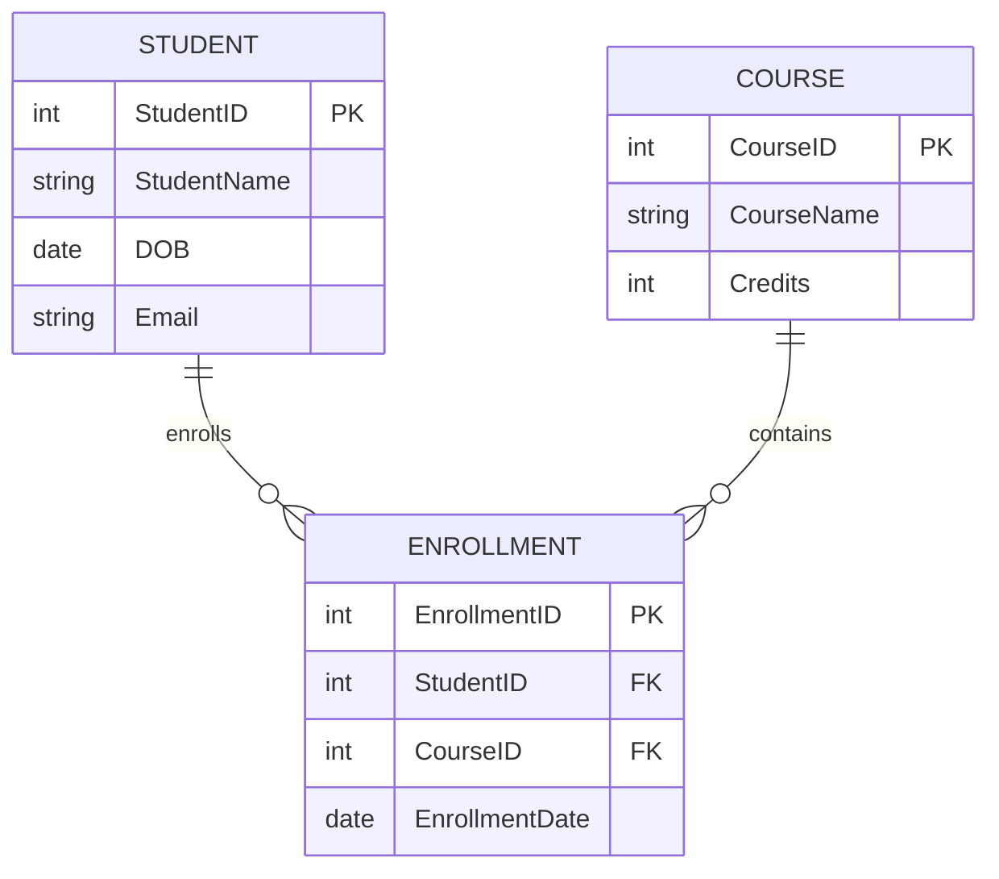

# ER Model

## 1. What is an ER Model?

The Entity-Relationship (ER) model is a conceptual model used to design the structure of a database.

It represents:

* **Entities** – objects such as Student, Course, Employee
* **Attributes** – properties such as StudentID, Name, Email
* **Relationships** – connections between entities

---

## 2. Entities

An **entity** is a real-world object about which data is stored.

Examples:

* Student
* Course
* Faculty
* Department

### Entity Set

An entity set is a collection of similar entities.

Example:

`STUDENT` → Student entity set

---

## 3. Attributes

An attribute describes a property of an entity.

Example:

**STUDENT**

* StudentID
* StudentName
* DOB
* Email

---

## 4. Relationships

A relationship shows how entities are connected.

Examples:

* Student **enrolls in** Course
* Faculty **teaches** Course
* Student **belongs to** Department

### Example ER Diagram

The following diagram shows the relationship between students and courses through enrollment:

**What the diagram shows:**

* One student can have many enrollments.
* One course can have many enrollments.
* `ENROLLMENT` connects `STUDENT` and `COURSE`.
* `StudentID` and `CourseID` in `ENROLLMENT` are foreign keys.

---

## 5. Cardinality

Cardinality describes how many entities can participate in a relationship.

### 1:1 — One-to-One

One entity is related to one entity.

Example:
`Person → Passport`

### 1:N — One-to-Many

One entity is related to many entities.

Example:
`Department → Students`

### M:N — Many-to-Many

Many entities are related to many entities.

Example:
`Students ↔ Courses`

Usually, an M:N relationship is converted into a separate table such as `ENROLLMENT`.

---

## 6. Specialization and Generalization

### Generalization

Combining similar entities into a higher-level entity.

Example:

`Faculty` + `Staff` → `Employee`

### Specialization

Dividing a general entity into specialized entities.

Example:

`Employee`
→ `Faculty`
→ `Staff`

---

## Key Takeaway

The ER model helps us design a database before writing SQL.

**Entity → Table**
**Attribute → Column**
**Relationship → Foreign Key / Relationship Table**
